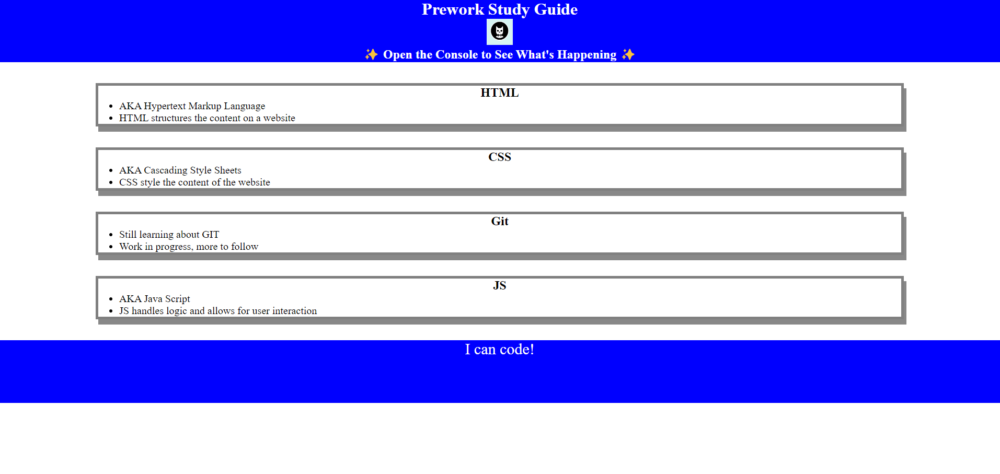

# <Prework Study Guide Webpage>

## Understanding the Basics

Before we run we learn to walk....before we walk, we learn to crawl. I say this to say that the purpose of this porject in a sense is to enable us to crawl

- A desire to undertand types of coding, and understanding of GitFLow was means to help motivate my journey
- Given what is said above, I find it quite intriguing to try and understand all the characters and numbers that make computer coding
- This basic web application helps bridge the gap of a begining undertanding and practical application, to full execution
- Throughout this exercise, I have been able to grasp a basic understanding of all intriquate parts of computer coding

## Table of Contents (Optional)

If your README is long, add a table of contents to make it easy for users to find what they need.

- [Installation](#installation)
- [Usage](#usage)
- [Credits](#credits)
- [License](#license)

## Installation

1. Create the HTML
    a. Review how HTML Structures a Webpage
    b. Set up HTML and Child Elements
    c. Complete GitFLow
2. Add CSS
    a. Create CSS File
    b. Link CSS File to HTML File
    c. Add styling using Class Attributes
    d. Complete GitFlow
3. Add Basic JS
    a. Add a variable to a JS File
    b. Add Conditional Logic using JS
    c. Incorporate Arrays and Loops
    d. Complete GitFlow
4. Add JS functions
    a. Write a function
    b. Call a funtion
    c. Complete GitFLow
5. Deploy the Prework Study Guide
    a. Create a Professional Project README
    b. Introduce Deployment
    c. Examine GitHub Pages
    d. Deploy GitHub Pages

## Usage

Coding with HTML, CSS, and JavaScript has now come full circle! Isn’t it exciting to see the Prework Study Guide website come together

To add a screenshot, create an `assets/images` folder in your repository and upload your screenshot to it. Then, using the relative file path, add it to your README using the following syntax:

## Credits

Introduction to Coding Boot Camp Prework / Pre-Work: UTA-VIRT-FSF-PT-02-2024-U-LOLC Tutorials

## License

MIT License (for public use)

